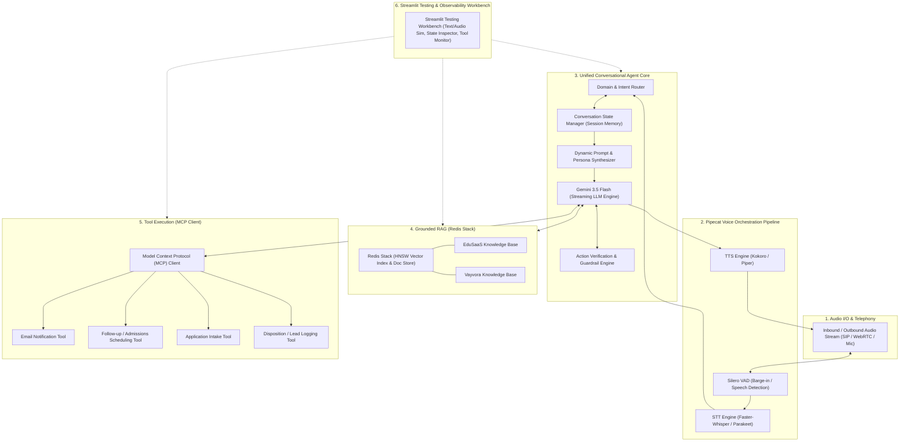
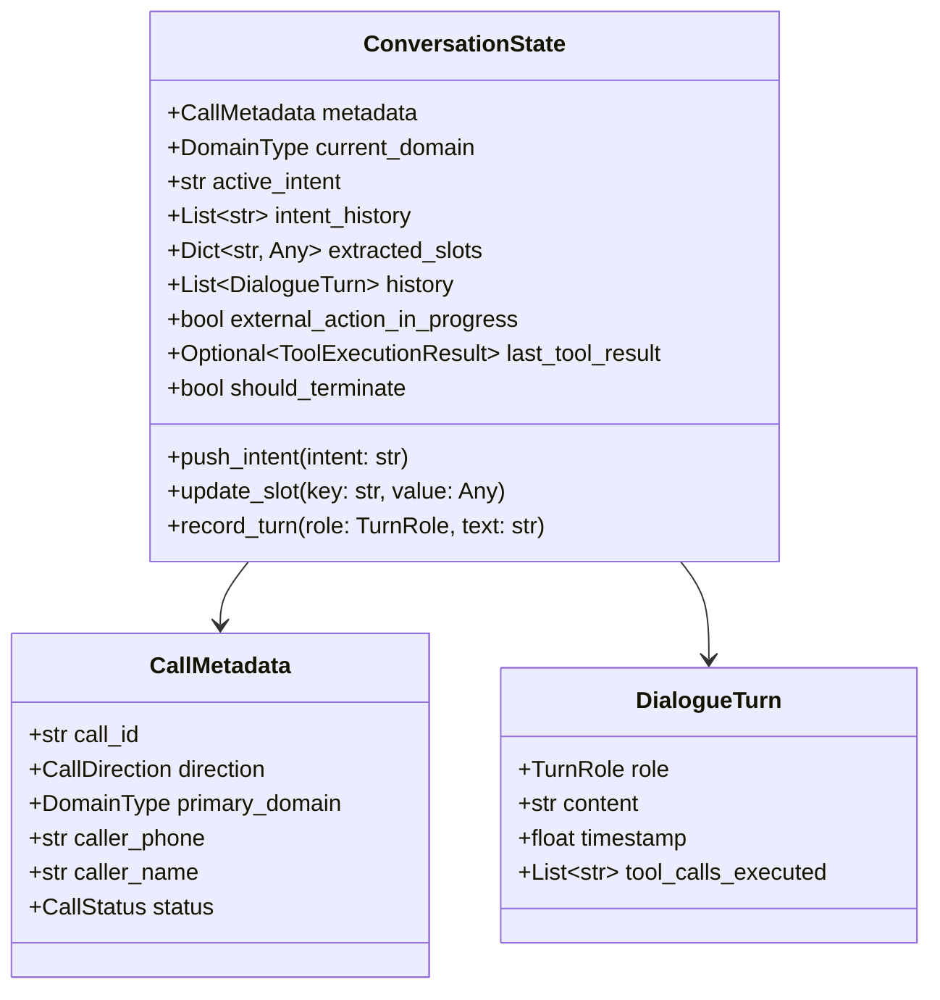
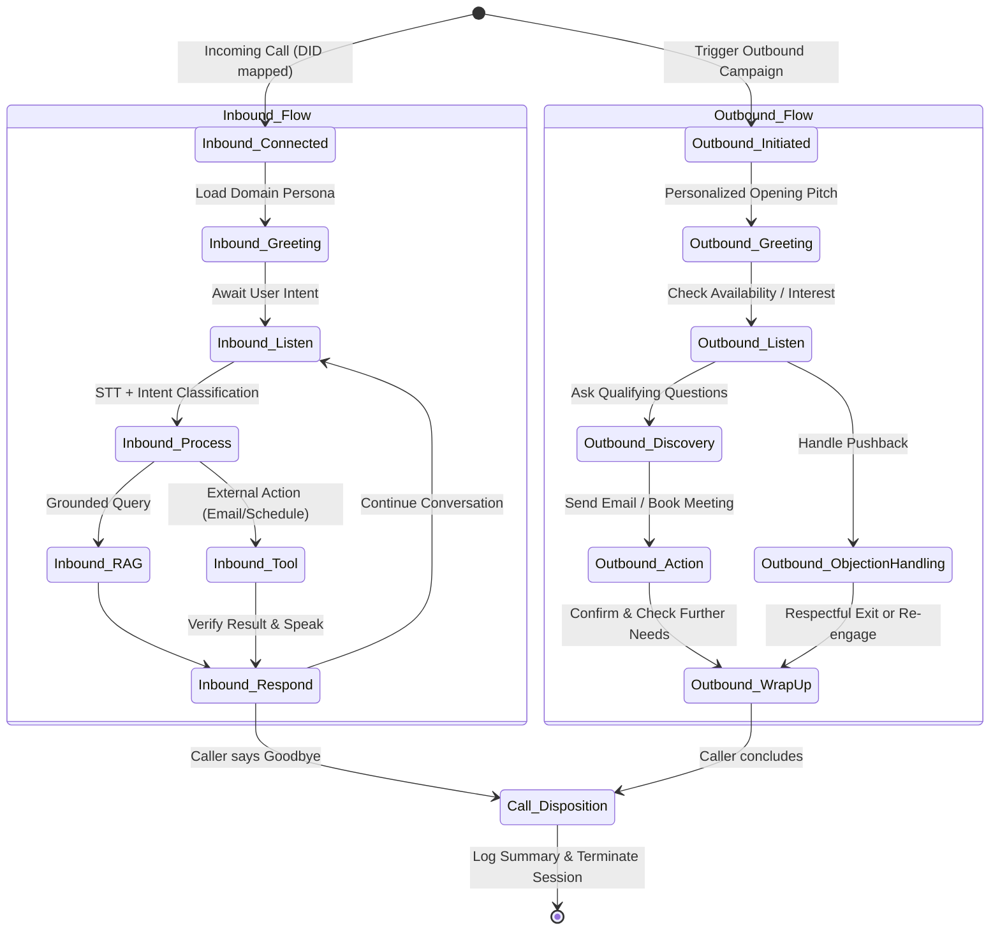
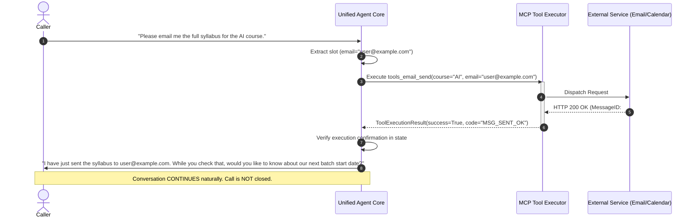

# System Architecture Document: Unified AI Voice Agent

**Target Location:** `C:\Users\Pawanganesh\Desktop\voice`  
**System Type:** Unified Real-Time Conversational AI Voice Agent  
**Language & Runtime:** Python 3.11+ (No Node.js, No Django)  
**Primary Technologies:** Gemini 3.5 Flash, Pipecat, Silero VAD, Faster-Whisper / Parakeet, Kokoro / Piper, Redis Stack, Model Context Protocol (MCP), Streamlit  

---

## 1. Executive Summary & Workspace Baseline

### 1.1 Workspace Inspection
- **Directory:** `C:\Users\Pawanganesh\Desktop\voice`
- **Initial State:** Empty directory (verified via filesystem check).
- **Scope of Step 0:** Architectural blueprint definition only. No code implementation, no package installation, and no side-effect modifications outside this target directory.

### 1.2 Core Architectural Principles
1. **Unified Agent Engine:** A single conversational core executes both inbound and outbound calls across two distinct domains (EduSaaS and Vayvora) via dynamic domain context injection rather than disjoint duplicate agents.
2. **Intent Primacy & Natural Flow:** Conversations are dynamic and prompt-guided with state guardrails, avoiding brittle decision trees. The caller's latest intent always supersedes prior conversation direction.
3. **Strict RAG Grounding:** Redis Stack provides isolated vector indexes per domain. Hallucinations are actively prevented by semantic thresholds and explicit context-grounding constraints.
4. **Verified Tool Execution:** External mutations (booking, emailing, applications) execute via Model Context Protocol (MCP) tool interfaces. The agent verifies execution confirmation before verbally acknowledging to the caller.
5. **Non-Terminating Action Loop:** Executing an external action never abruptly disconnects or terminates the session; the agent informs the caller of the outcome and keeps the floor open unless the caller explicitly signals termination.
6. **Low-Latency Voice Pipeline:** Audio streaming is orchestrated by Pipecat, integrating Silero VAD for sub-millisecond barge-in detection, streaming STT (Faster-Whisper/Parakeet), streaming LLM responses (Gemini 3.5 Flash), and neural chunked TTS (Kokoro/Piper).

---

## 2. High-Level Architecture Diagram



---

## 3. Major Modules and Responsibilities

| Module Path | Module Name | Primary Responsibility | Anti-Responsibilities (What it MUST NOT do) |
| :--- | :--- | :--- | :--- |
| `src/core/` | **Agent Core & LLM Engine** | Manages prompt assembly, LLM invocation with Gemini 3.5 Flash, streaming response handling, and intent orchestration. | Never calls external APIs directly (must delegate to `tools/mcp/`); never renders UI. |
| `src/pipeline/` | **Voice Pipeline (Pipecat)** | Manages streaming audio frames, Silero VAD state, STT chunking, and TTS audio synthesis queue. Handles audio interruption (barge-in). | Never handles business domain logic or database updates directly. |
| `src/state/` | **Session & State Manager** | Tracks call metadata, caller entity slots, active intent stack, dialogue turns, and domain switching history. | Does not determine natural language replies. |
| `src/rag/` | **Redis Grounded RAG** | Performs vector embeddings, cosine similarity searches, and context retrieval against domain-specific documents in Redis Stack. | Must never synthesize conversational replies; strictly returns context chunks and confidence scores. |
| `src/tools/` | **MCP Client & Tool Registry** | Discovers, formats, validates, and invokes external MCP tools (email, calendar, CRM, job intake). Verifies return status. | Does not speak directly to the user; returns structured status back to LLM. |
| `src/domains/` | **Domain Definitions** | Defines domain configuration, personas, domain-specific slots, policies, and knowledge schema for **EduSaaS** and **Vayvora**. | Does not manage voice hardware or network sockets. |
| `src/telephony/` | **Call Session Lifecycle** | Manages inbound call entry points, outbound campaign targets, call initiation, disposition tracking, and hang-up signaling. | Does not parse user voice; hands raw stream to `src/pipeline/`. |
| `src/ui/` | **Streamlit Testing Workbench** | Interactive UI for manual and semi-automated testing: mock text chat, simulated voice calls, RAG search inspector, and tool debuggers. | Production runtime does not depend on this module. |

---

## 4. Module Interfaces & Data Contracts

All internal communication between modules uses explicit Pydantic v2 / Dataclass models.

```python
# Conceptual Type Definitions (to be implemented in src/core/types.py)

from enum import Enum
from typing import List, Dict, Any, Optional
from pydantic import BaseModel, Field

class DomainType(str, Enum):
    EDUSAAS = "edusaas"
    VAYVORA = "vayvora"
    GENERAL = "general"

class CallDirection(str, Enum):
    INBOUND = "inbound"
    OUTBOUND = "outbound"

class CallStatus(str, Enum):
    RINGING = "ringing"
    ACTIVE = "active"
    ON_HOLD = "on_hold"
    COMPLETED = "completed"
    FAILED = "failed"

class TurnRole(str, Enum):
    CALLER = "caller"
    AGENT = "agent"
    SYSTEM = "system"
    TOOL = "tool"

class DialogueTurn(BaseModel):
    role: TurnRole
    content: str
    timestamp: float
    grounded_citations: List[str] = Field(default_factory=list)
    tool_calls_executed: List[str] = Field(default_factory=list)
    intent_detected: Optional[str] = None

class CallMetadata(BaseModel):
    call_id: str
    direction: CallDirection
    primary_domain: DomainType
    caller_phone: str
    caller_name: Optional[str] = None
    campaign_id: Optional[str] = None  # Populated for outbound calls
    outbound_objective: Optional[str] = None # e.g. "Course re-engagement"
    status: CallStatus = CallStatus.RINGING
    start_time: float
    end_time: Optional[float] = None

class RAGQuery(BaseModel):
    domain: DomainType
    query_text: str
    top_k: int = 3
    relevance_threshold: float = 0.70

class RAGChunk(BaseModel):
    doc_id: str
    domain: DomainType
    title: str
    content: str
    score: float
    metadata: Dict[str, Any] = Field(default_factory=dict)

class ToolCallRequest(BaseModel):
    tool_name: str
    arguments: Dict[str, Any]
    call_id: str

class ToolExecutionResult(BaseModel):
    tool_name: str
    success: bool
    data: Dict[str, Any] = Field(default_factory=dict)
    error_message: Optional[str] = None
    verification_code: Optional[str] = None
```

---

## 5. Conversation State Model

The conversation state preserves complete context while maintaining responsiveness to user-driven shifts in topic:



### 5.1 Intent Priority & Preemption Mechanism
- **Rule of Intent Primacy:** If the caller utters an intent that diverges from the agent's prior turn (e.g., during an outbound course pitch, the caller suddenly asks *"Wait, where is your office located?"*), the agent **must not** insist on its prior pitch.
- **Preemption Handling:**
  1. The new caller utterance is analyzed by the Router.
  2. If a topic shift is detected, the `active_intent` is pushed to `intent_history` and the new intent becomes active.
  3. Domain routing evaluates if the question belongs to EduSaaS or Vayvora.
  4. The agent answers the immediate question using Grounded RAG.
  5. The agent then politely checks if the caller wishes to resume the previous topic or continue with the new inquiry.

---

## 6. Business Domain Routing & Specifications

The agent is unified in code and execution, configured via domain-specific policy definitions:

```
src/domains/
├── base.py              # Base Domain Configuration Interface
├── edusaas/
│   ├── config.py        # EduSaaS Persona, Prompts, & Intent definitions
│   ├── slots.py         # Course, qualification, budget, timeline slots
│   └── knowledge/       # Markdown/PDF seed knowledge for Redis
└── vayvora/
    ├── config.py        # Vayvora Persona, Prompts, & Intent definitions
    ├── slots.py         # Role, experience, company, AI project requirement slots
    └── knowledge/       # Services, tech stack, office location, job openings seed knowledge
```

### 6.1 Domain 1: EduSaaS
- **Core Topics:**
  - Student course inquiries (curriculum, prerequisites, schedules).
  - Intelligent course recommendations based on student background.
  - Initial assessment guidance.
  - Enrollment inquiries & tuition details.
  - Outbound student outreach (explaining offerings, handling objections).
  - Emailing course brochures and syllabi.
  - Scheduling follow-up consultations with admissions/HR advisors.
- **Key Slots:** `student_name`, `email`, `target_course`, `background_education`, `experience_level`, `preferred_batch_time`, `admissions_callback_time`.

### 6.2 Domain 2: Vayvora
- **Core Topics:**
  - Student / job seeker inquiries: Careers, open roles (AI/ML engineers, full-stack, data scientists), job application guidelines, company culture, office location.
  - Corporate / client inquiries: Enterprise AI services, custom software engineering, product portfolio, requirement discovery.
  - Outbound corporate product outreach: Gauging product interest, qualifying custom AI needs, scheduling client discovery calls.
- **Key Slots:** `contact_name`, `company_name`, `email`, `inquirer_type` (Candidate vs Corporate Client), `role_applied_for`, `technical_requirement_summary`, `budget_range`, `discovery_meeting_slot`.

### 6.3 Domain Routing Logic
- **Inbound Calls:**
  - Routed initially by incoming Direct Inward Dialing (DID) number / virtual number mapping.
  - Fallback: If calling a general number, caller's initial request is classified by the `Router` into `EDUSAAS` or `VAYVORA`.
  - Dynamic cross-routing: If a caller calls EduSaaS but asks about corporate software development at Vayvora, the agent cleanly states the affiliation, shifts `current_domain` to `VAYVORA`, loads Vayvora RAG/prompts, and handles the request.
- **Outbound Calls:**
  - Campaign metadata explicitly assigns the domain upon launch (`campaign.domain = EDUSAAS` or `VAYVORA`).

---

## 7. Inbound vs Outbound Model



### 7.1 Outbound Call Mechanics
- **Personalized Context:** Outbound calls carry lead profile data (e.g., candidate name, previous course page visited, or enterprise company name).
- **Opening Flow:** Non-aggressive introduction:
  1. Identify caller and state organization clearly.
  2. Verify if it is a convenient time to talk.
  3. Deliver concise value proposition (under 25 words).
  4. Invite reaction or answer immediate objections.
- **Objection Handling Strategy:** Never argue or talk over the caller; acknowledge the objection, offer concise clarification, and respect requests not to be contacted.

---

## 8. Grounded RAG Architecture (Redis Stack)

### 8.1 Isolation & Indexing
- Redis Stack stores vector embeddings and structured metadata under isolated prefixes:
  - `rag:edusaas:doc:<doc_id>` with index `idx:edusaas_vdb`
  - `rag:vayvora:doc:<doc_id>` with index `idx:vayvora_vdb`
- **Vector Algorithm:** HNSW (Hierarchical Navigable Small World) with Cosine Distance.
- **Embeddings:** Fast local embeddings via HuggingFace or lightweight Gemini embedding API.

### 8.2 Retrieval & Grounding Verification Loop
1. User question is extracted from turn.
2. Embedding generated for search query.
3. Redis vector search executes with filter: `(@domain == $active_domain)`.
4. Relevance Score Guardrail:
   - If `score < threshold` (e.g. cosine similarity < 0.70): Context is marked as *Insufficient*.
   - System prompt explicitly enforces: *"The provided knowledge base does not contain this information. State clearly that you do not have this detail on file and offer to connect them with a human advisor."*
5. Citations: Chunks carry doc identifiers to track where facts originated.

---

## 9. MCP (Model Context Protocol) & Tool Execution Layer

All actions that interact with outside systems (emailing, calendar bookings, saving leads, job application intake) are exposed via MCP tool servers or internal MCP tool adapters.

### 9.1 Tool Inventory
1. `tools_email_send(recipient_email, subject, body_template, attachment_id)`: Sends course brochures, syllabus PDFs, or corporate overview decks.
2. `tools_calendar_book(attendee_name, attendee_email, preferred_timestamp, meeting_type)`: Books an admissions interview or sales discovery meeting.
3. `tools_application_submit(candidate_name, email, phone, role_title, experience_summary)`: Enters a job seeker's application into the recruitment queue.
4. `tools_crm_log_disposition(call_id, domain, outcome, notes, follow_up_required)`: Records call conclusion and summary.

### 9.2 Tool Verification and Non-Terminating Flow


- **Verification Failure Handling:** If `success=False`, the agent informs the caller: *"I attempted to send that email, but encountered a system issue. I've flagged this for our team to dispatch manually right after this call."* The agent remains on the line.

---

## 10. Voice Pipeline Architecture (Pipecat)

The voice pipeline handles the physical layer of the interaction:

```
[Audio Input Device / SIP Frame]
             │
             ▼
   [Silero VAD Engine]  ────── (Speech Start) ───► [Trigger Barge-in / Cancel TTS playback]
             │
      (Speech End)
             │
             ▼
[Streaming STT (Faster-Whisper / Parakeet)]
             │
      (Transcript Text)
             │
             ▼
 [Unified Agent Core (Gemini 3.5 Flash)]
             │
       (Token Stream)
             │
             ▼
  [TTS Engine (Kokoro / Piper)]
             │
      (Audio Packets)
             │
             ▼
[Audio Output Device / SIP Stream]
```

### 10.1 Pipeline Specifications
- **Voice Orchestration:** Pipecat pipeline manages frame scheduling, pipeline queues, and synchronization.
- **Voice Activity Detection (VAD):** Silero VAD running locally. Configured with a 300ms silence threshold for turn completion and immediate voice detection for user barge-in.
- **Speech-to-Text (STT):** Faster-Whisper / NVIDIA Parakeet running in streaming mode to deliver incremental text with low latency.
- **LLM:** Gemini 3.5 Flash streaming via API with structured tool-calling support.
- **Text-to-Speech (TTS):** Kokoro / Piper local neural synthesis. Streaming sentence-by-sentence to produce audio chunks with sub-second time-to-first-audio (TTFA).
- **Barge-in / Interruptibility:**
  - If Silero VAD detects user speech while TTS is streaming audio:
    1. Pipecat immediately flushes the audio playback buffer.
    2. Any ongoing TTS generation is aborted.
    3. Gemini LLM generation is cancelled.
    4. STT buffers the incoming speech and routes the new user intent to Agent Core.

---

## 11. Streamlit Testing Workbench Boundary

The Streamlit workbench (`src/ui/app.py`) is an operational test harness to evaluate all components without requiring telephony infrastructure:

### 11.1 Workbench Capabilities
1. **Interactive Chat Mode:** Full text-based conversation simulator supporting both Inbound and Outbound scenarios.
2. **Audio Simulation Mode:** Allows recording from browser microphone or playing pre-recorded `.wav` files into the STT/VAD pipeline.
3. **Live State Inspector:** Real-time visibility into `ConversationState`, including active domain, slot values, intent stack, and raw context history.
4. **Tool Execution Tracer:** Inspects MCP tool payloads, mock server responses, and verification outcomes.
5. **RAG Search & Retrieval Debugger:** Test queries directly against Redis Stack vector indexes with visualization of chunk text, similarity distance, and domain tags.
6. **Domain Switcher & Outbound Scenario Builder:** Simulates outbound campaigns with preset contact details to verify greeting pitches and objection flows.

---

## 12. Incremental Implementation Phases

```mermaid
gantt
    title AI Voice Agent Implementation Roadmap
    dateFormat  X
    axisFormat Phase %d

    section Phase 1 to 3: Core & State
    Phase 1 - Environment & Base Contracts   :p1, 0, 1
    Phase 2 - Domain Engine & State System   :p2, 1, 2
    Phase 3 - Gemini 3.5 Flash LLM Engine    :p3, 2, 3

    section Phase 4 to 6: RAG, MCP & Testing
    Phase 4 - Redis Stack Grounded RAG       :p4, 3, 4
    Phase 5 - MCP Tool Layer & Verification  :p5, 4, 5
    Phase 6 - Streamlit Testing Workbench    :p6, 5, 6

    section Phase 7 to 9: Voice & Integration
    Phase 7 - Local Audio Engines (VAD/STT/TTS):p7, 6, 7
    Phase 8 - Pipecat Voice Orchestration    :p8, 7, 8
    Phase 9 - End-to-End Inbound & Outbound  :p9, 8, 9
```



### Detailed Phase Breakdown

#### Phase 1: Environment & Base Contracts
- **Focus:** Directory layout, typing definitions, configuration management (`pydantic-settings`), logging, and environment variable validation.
- **Artifacts:** `src/core/types.py`, `src/config.py`, `pyproject.toml`.

#### Phase 2: Domain Engine & State Management
- **Focus:** State store implementation, intent stack, slot extraction data structures, EduSaaS and Vayvora configuration schemas.
- **Artifacts:** `src/state/manager.py`, `src/domains/edusaas/`, `src/domains/vayvora/`.

#### Phase 3: Gemini 3.5 Flash LLM Integration
- **Focus:** Gemini API client wrapper, dynamic system prompt synthesis, conversation history formatting, streaming token processing.
- **Artifacts:** `src/core/llm.py`, `src/core/router.py`.

#### Phase 4: Redis Stack Grounded RAG Implementation
- **Focus:** Redis client connection, vector schema creation (HNSW index), document ingestion scripts, cosine similarity search, relevance threshold filter.
- **Artifacts:** `src/rag/redis_client.py`, `src/rag/retriever.py`, `data/seed/`.

#### Phase 5: MCP Tool Layer & Verification
- **Focus:** MCP client adapter, tool schema generation for Gemini, mock tool implementations (Email, Calendar, Job Intake, CRM), verification validator.
- **Artifacts:** `src/tools/mcp_client.py`, `src/tools/registry.py`.

#### Phase 6: Streamlit Testing Workbench
- **Focus:** Multi-page Streamlit testing UI for text simulation, state inspection, RAG testing, and tool call visualization.
- **Artifacts:** `src/ui/app.py`, `src/ui/components/`.

#### Phase 7: Local Audio Engines (VAD, STT, TTS)
- **Focus:** Silero VAD wrapper, Faster-Whisper / Parakeet model loading, Kokoro / Piper synthesis engine. Independent audio unit testing.
- **Artifacts:** `src/pipeline/vad.py`, `src/pipeline/stt.py`, `src/pipeline/tts.py`.

#### Phase 8: Pipecat Voice Orchestration & Interruption
- **Focus:** Connecting VAD, STT, Agent Core, and TTS inside Pipecat pipeline. Frame scheduling, barge-in audio queue cancellation.
- **Artifacts:** `src/pipeline/orchestrator.py`.

#### Phase 9: End-to-End Inbound & Outbound Integration
- **Focus:** Inbound call simulation, outbound campaign automated runner, comprehensive stress testing, latency profiling.
- **Artifacts:** `src/telephony/session.py`, `tests/e2e/`.

---

## 13. Comprehensive Testing Matrix (Per Phase)

| Phase | Test Target | Test Methodology | Success Criteria |
| :--- | :--- | :--- | :--- |
| **Phase 1** | Configuration & Data Contracts | Unit test schema validation with `pytest` | Valid and invalid configs tested; all Pydantic models serialize and deserialize without errors. |
| **Phase 2** | State Manager & Domain Routing | Deterministic state transition tests | Slot extraction persists correctly; domain switches occur on trigger; intent stack preserves prior intents. |
| **Phase 3** | Gemini 3.5 Flash Engine | Mocked & live Gemini API calls | Streaming response generator works; structured tool calls format correctly; system prompts adapt to domain. |
| **Phase 4** | Redis Stack Grounded RAG | Vector search recall & threshold testing | Documents indexed under correct namespace; query retrieves relevant chunks; below-threshold queries return empty context without hallucinating. |
| **Phase 5** | MCP Tools & Verification | Mock MCP server invocations | Tools execute cleanly; return status is validated; agent verbally acknowledges tool completion and continues dialogue. |
| **Phase 6** | Streamlit UI Workbench | Manual UI validation & integration test | Full inbound/outbound text conversation completes across EduSaaS and Vayvora; state and tool calls display accurately in UI. |
| **Phase 7** | Audio Components (VAD/STT/TTS) | Audio file feed & playback tests | Silero detects speech boundaries; Faster-Whisper transcribes sample `.wav` accurately; Kokoro/Piper produces audible speech frames. |
| **Phase 8** | Pipecat Orchestration & Barge-in | Live microphone / loopback audio test | Speaking while TTS is playing immediately halts audio output (< 300ms); new speech is processed without crashing. |
| **Phase 9** | End-to-End Verification | Simulated Inbound & Outbound Scenarios | Agent completes full workflows (e.g. course recommendation + syllabus email + booking consultation) without dropping the line or losing context. |

---

## 14. Architecture Review & Sign-Off Checklist

- [x] Python only; No Node.js; No Django.
- [x] Incorporates Gemini 3.5 Flash, Pipecat, Silero VAD, Faster-Whisper/Parakeet, Kokoro/Piper, Redis Stack, MCP, and Streamlit.
- [x] Unified agent model with dual-domain isolation (EduSaaS and Vayvora).
- [x] Covers both Inbound and Outbound call lifecycles.
- [x] Latest user intent given highest priority with conversational preemption.
- [x] Strict Grounded RAG boundaries defined with confidence thresholds.
- [x] MCP tools require explicit execution verification.
- [x] Non-terminating conversation flow after tool execution.
- [x] Full voice pipeline with sub-second latency and barge-in capability.
- [x] Dedicated Streamlit test harness defined.
- [x] 9-phase incremental implementation plan with concrete testing gates.
- [x] Target directory maintained: `C:\Users\Pawanganesh\Desktop\voice`.
