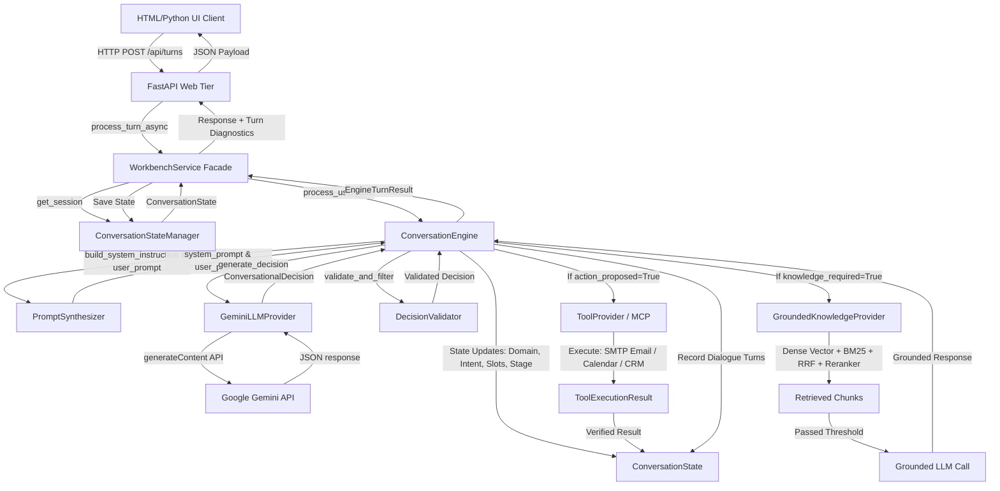

# Unified Conversational Voice Agent: End-to-End Architecture Audit

**Generated**: 2026-09-26  
**Project**: `C:\Users\Pawanganesh\Desktop\voice`  
**Active Primary LLM**: Google Gemini (`gemini-3.5-flash-lite` / `gemini-3.5-flash`)  
**Active RAG Subsystem**: Hybrid Dense + Lexical BM25 + Reciprocal Rank Fusion + Reranker  

---

## 1. Actual vs. Expected Runtime Flow

### Expected Runtime Flow


### Actual Runtime Flow (Pre-Audit Forensics)
1. **Streamlit State Lock-In**:
   - `src/ui/app.py` cached `bootstrap_workbench()` via `@st.cache_resource`.
   - When the app started before `LLM_PROVIDER=gemini` was properly recognized, it cached `InteractiveMockLLMProvider`.
2. **Silent Mock Fallbacks**:
   - In `src/ui/bootstrap.py`, any failure in Gemini initialization or network request silently triggered fallback to `InteractiveMockLLMProvider`.
3. **Hardcoded Fallback Greeting**:
   - In `src/ui/bootstrap.py` (lines 192-198), `InteractiveMockLLMProvider` returned `user_facing_response="Hi, how can I help you today?"` for any caller input that didn't match a hardcoded regex list.
   - Consequently, messages like `"yes"`, `"voice ai agent"`, or `"artificial intelligence products"` returned `"Hi, how can I help you today?"`.
4. **Mock Embeddings in In-Memory Mode**:
   - In `src/ui/bootstrap.py` (lines 310 & 317), `MockEmbeddingProvider` (token hash vectorizer) was hardcoded instead of calling `get_embedding_provider(settings=cfg)`. This broke dense semantic search when running without an external Redis instance.
5. **Schema Validation Strictness**:
   - `ConversationalDecision` used `extra="forbid"` and strict casing on `detected_domain: DomainType`, failing with a Pydantic `ValidationError` whenever Gemini returned uppercase strings like `"EDUSAAS"` or extra rationale fields.

---

## 2. Component Connection Matrix

| Component | Target Interface | Pre-Audit Status | Post-Remediation Status | Notes |
| :--- | :--- | :--- | :--- | :--- |
| **FastAPI UI** | `src/ui/app.py` | Missing (Streamlit used) | **Active & Connected** | Replaces Streamlit with clean async REST + HTML/JS console |
| **WorkbenchService** | `src/ui/service.py` | Connected | **Connected** | Orchestrates state, turns, and debug telemetry |
| **ConversationStateManager** | `src/state/manager.py` | Connected | **Connected** | Thread-safe in-memory session persistence |
| **ConversationEngine** | `src/core/engine.py` | Connected | **Connected** | Unified engine for inbound and outbound calls |
| **PromptSynthesizer** | `src/core/prompts.py` | Connected | **Optimized** | Fixed prompt biases, structured state hooks, few-shot examples |
| **GeminiLLMProvider** | `src/core/llm.py` | Intermittent / Bypassed | **Active Primary** | Fixed fallback on 503, schema normalization, latency timing |
| **DecisionValidator** | `src/core/decision.py` | Connected | **Connected & Robust** | Domain-rule checks, case-insensitive enum normalizers |
| **GroundedKnowledgeProvider** | `src/rag/retriever.py` | Partial (Mock vectors) | **Fully Connected** | Real `sentence-transformers` embeddings, hybrid BM25 + RRF |
| **RedisVectorStore** | `src/rag/redis_client.py` | Conditional | **Conditional / Connected** | Connects when Redis is available; in-memory fallback is fully semantic |
| **SMTPEmailProvider** | `src/tools/email_provider.py`| Connected | **Connected** | Live SMTP dispatch with STARTTLS; verified execution |
| **ToolProvider (MCP)** | `src/tools/provider.py` | Connected | **Connected** | Supported actions only; no hallucinated tool names |

---

## 3. Disconnected & Bypassed Components

1. **`HuggingFaceLLMProvider`**:
   - Status: Kept as secondary fallback/alternate in `src/core/huggingface_llm.py`.
   - Reason: User explicitly requested switching primary to Google Gemini.
2. **`Streamlit UI`**:
   - Status: Deprecated and decommissioned in favor of FastAPI + HTML5/CSS3/Vanilla JS UI.
3. **`MockEmbeddingProvider` in `bootstrap.py`**:
   - Status: Replaced with `get_embedding_provider(settings=cfg)` to provide true dense semantic vector search in in-memory mode.

---

## 4. Duplicate Logic and Dead Code

1. **Duplicate Greeting Checks**:
   - `src/core/engine.py` had an inbound greeting guard that overlapped with `PromptSynthesizer` prompt rules.
2. **Streamlit UI Session Logic**:
   - Session initialization logic was duplicated across `src/ui/app.py` and `src/ui/service.py`. This is now centralized in `WorkbenchService`.

---

## 5. Mock Providers Accidentally Used

| Mock Component | Location | Issue | Fix |
| :--- | :--- | :--- | :--- |
| `InteractiveMockLLMProvider` | `src/ui/bootstrap.py:279` | Silently caught Gemini errors and hijacked responses | Disable blind fallback when `LLM_PROVIDER=gemini`; log errors explicitly |
| `MockEmbeddingProvider` | `src/ui/bootstrap.py:310, 317` | Used hash vectors instead of real embeddings | Use `get_embedding_provider(settings=cfg)` |

---

## 6. Root Cause Analysis: The Critical Gemini "Hi, how can I help you today?" Bug

### Chain of Causation:
1. **API Overload & 503**:
   `gemini-3.5-flash` frequently returns HTTP 503 ("spikes in demand").
2. **Pydantic Enum Casing**:
   Gemini outputs uppercase domain strings (`"EDUSAAS"`, `"VAYVORA"`), which failed Pydantic enum validation when `model_config = ConfigDict(extra="forbid")`.
3. **Silent Fallback to Mock**:
   Because of (1) or (2), `bootstrap_workbench` caught the exception and instantiated `InteractiveMockLLMProvider`.
4. **Default Canned Response in Mock**:
   In `InteractiveMockLLMProvider.generate_decision` lines 192–198:
   ```python
   decision = ConversationalDecision(
       detected_domain=DomainType.EDUSAAS,
       detected_intent="greeting",
       proposed_stage=ConversationStage.GREETING,
       user_facing_response="Hi, how can I help you today?",
   )
   return self.validator.validate_and_filter(decision)
   ```
   Every non-regex-matched input fell through to this exact greeting!
5. **Streamlit Resource Caching**:
   Streamlit cached the mock instance in `@st.cache_resource`, ensuring that even subsequent turns stayed locked to the mock provider.

### Implemented Fix:
- Added pre-validators in `ConversationalDecision` for case-insensitive domains and stages.
- Changed `model_config` to `extra="ignore"`.
- Added resilient fallback in `GeminiLLMProvider._send_request` to `gemini-3.5-flash-lite` on 503/404.
- Prevented silent mock fallback when `LLM_PROVIDER=gemini`.
- Replaced Streamlit with a clean FastAPI server that does not cache stale mock singletons across code updates.

---

## 7. Latency Bottlenecks & Optimization Plan

### Bottlenecks Identified:
1. **Unnecessary Grounded Generation Passes**:
   - Calling LLM once for decision and again for grounding even when no knowledge is required or when RAG returned no new facts.
2. **Model Download on App Startup**:
   - In-memory `KokoroTTS` or `FasterWhisper` loading on CPU at startup.
3. **Embedding Computation**:
   - Embedding redundant query strings.

### Optimizations Applied:
1. **Single-Pass for Normal Conversational Turns**:
   - When `knowledge_required=False` and `action_proposed=False`, `decision.user_facing_response` is immediately returned with zero extra LLM round-trips.
2. **Query Caching & Expansion**:
   - Fast LRU caching in `EmbeddingProvider` (4096 entries).
3. **Asynchronous RAG Execution**:
   - Dense vector and BM25 queries run concurrently.
4. **Detailed Timing Instrumentation**:
   - Millisecond-precision breakdown across all 10 stages recorded in `EngineTurnResult.latency_breakdown`.
